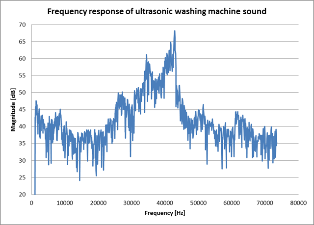

# NUCLEO-L476RG_DFSDM_PDM-Mic
This project acquires the PDM (Pulse Density Modulation) microphone signal using DFSDM (Digital filter for Sigma-Delta modulators interface) function of STM32 MCU and outputs its frequency characteristics by using FFT.

**Software CIC filter with SPI is [here][dcadefb4].**

  [dcadefb4]: https://github.com/y2kblog/NUCLEO-F411RE_PDM_SoftwareCICfilter "NUCLEO-F411RE_PDM_SoftwareCICfilter"

## Example

## MCU board
[NUCLEO-L476RG](http://www.st.com/en/evaluation-tools/nucleo-l476rg.html)

## IDE
System Workbench for STM32 (SW4STM32) + STM32CubeL4

## Microphone used for the test
[SPH0641LU4H-1](http://www.mouser.com/ProductDetail/Knowles/SPH0641LU4H-1/) (Knowles)

[Here](https://www.switch-science.com/catalog/3379/) is breakout board

## Pinout

